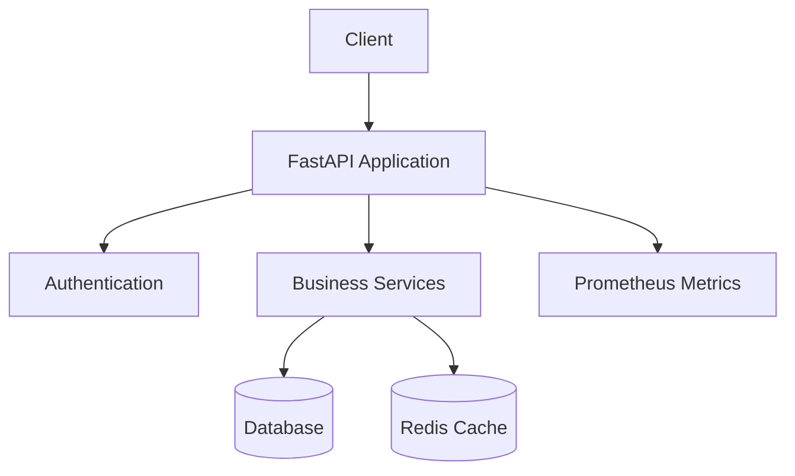
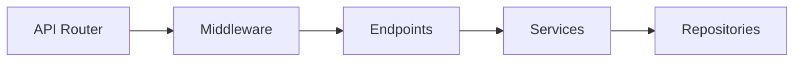
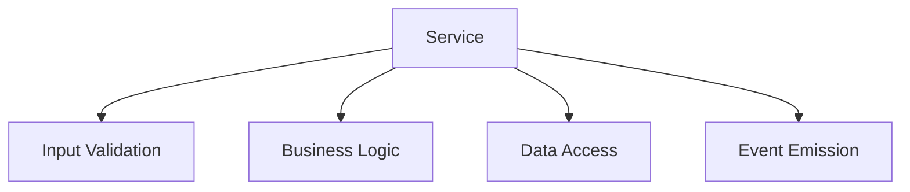
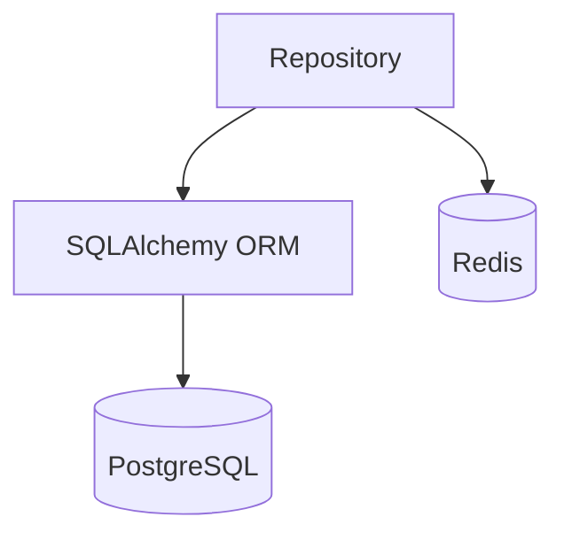
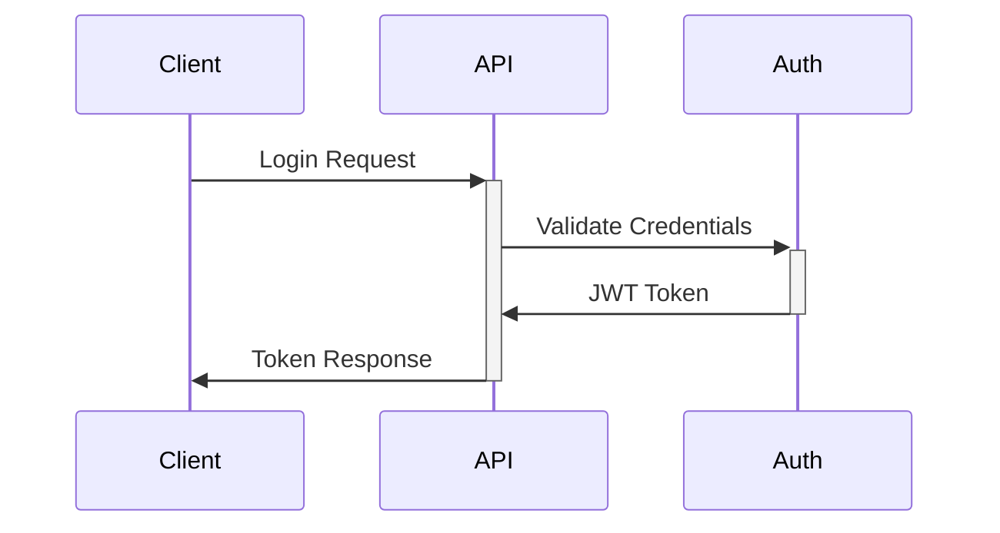

# System Architecture

## Version
2.0.0

## Last Updated
2025-02-09

## Overview
This document describes the system architecture of the {{ project_name }} Project, 
including its components, interactions, and design decisions.

## Table of Contents
1. [System Overview](#system-overview)
2. [Component Architecture](#component-architecture)
3. [Data Flow](#data-flow)
4. [Security Architecture](#security-architecture)
5. [Scalability Considerations](#scalability-considerations)

## System Overview

### High-Level Architecture

### Key Components
1. **FastAPI Application**
   - REST API endpoints
   - Request validation
   - Response formatting
   - Error handling

2. **Authentication System**
   - JWT tokens
   - Refresh token mechanism
   - Role-based access control

3. **Business Services**
   - Core business logic
   - Data processing
   - External integrations

4. **Data Storage**
   - PostgreSQL database
   - Redis cache
   - File storage (optional)

## Component Architecture

### API Layer

### Service Layer

### Data Layer

## Data Flow

### Request Flow
1. Client sends request
2. Middleware processes request
3. Router directs to endpoint
4. Endpoint validates input
5. Service processes request
6. Repository handles data
7. Response returns to client

### Authentication Flow

## Security Architecture

### Authentication
- JWT tokens with short expiration
- Refresh token rotation
- Password hashing with bcrypt

### Authorization
- Role-based access control
- Resource-level permissions
- API scope restrictions

### Data Protection
- TLS encryption
- Database encryption
- Secure headers

## Scalability Considerations

### Horizontal Scaling
- Stateless application design
- Load balancer ready
- Session management via Redis

### Performance Optimization
- Database indexing
- Query optimization
- Caching strategy

### Monitoring
- Prometheus metrics
- Structured logging
- Health checks 